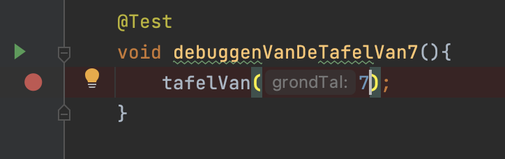
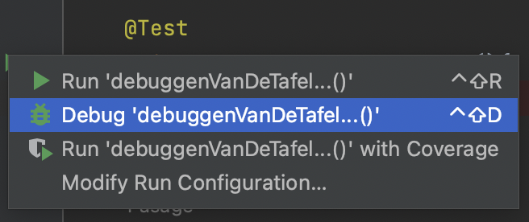
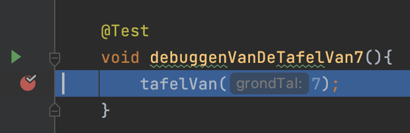
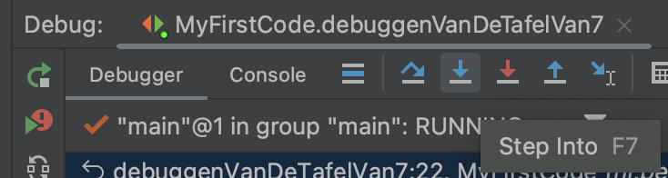
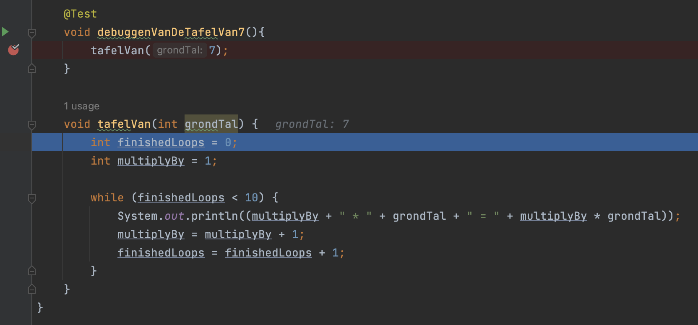
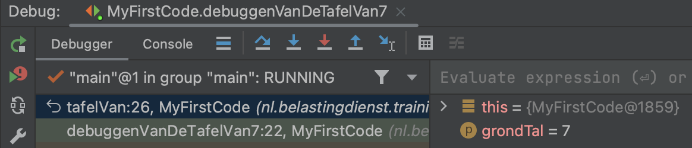
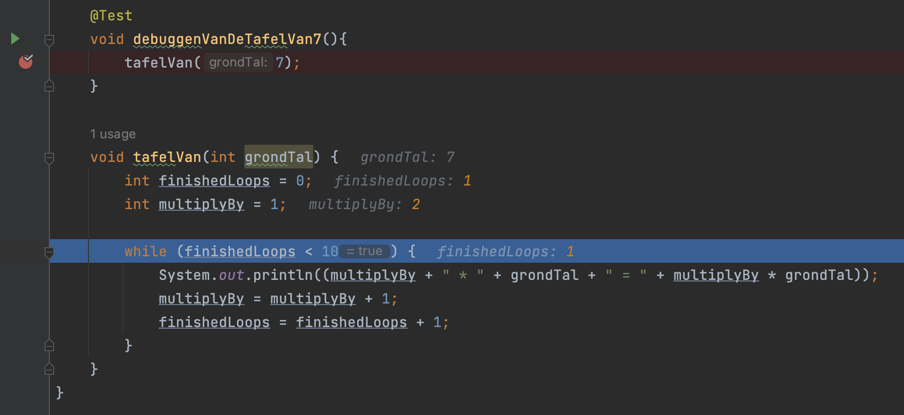
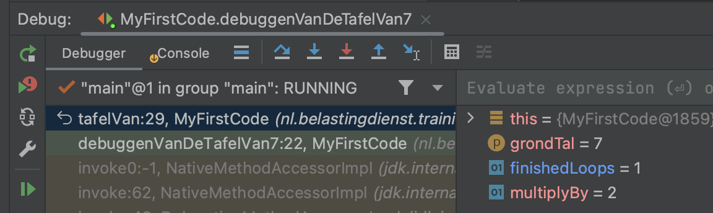
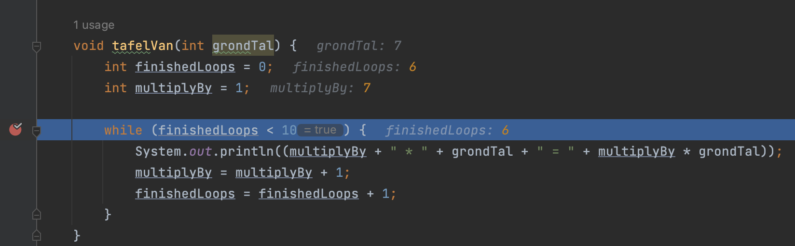

## De debugger

---

### Inzicht krijgen in code executie

```java
@Test
public void voerDeTafelVan7EnVan8Uit(){
	tafelVan(7);
}
```

---

### We willen inzicht krijgen in de code

```java
void tafelVan(int grondTal) {
	int finishedLoops = 0;
	int multiplyBy = 1;

	while (finishedLoops < 10) {
		p(multiplyBy + " * " + grondTal + " = " + multiplyBy * grondTal);
		multiplyBy = multiplyBy + 1;
		finishedLoops = finishedLoops + 1;
	}
}
```

---

### Zet een breakpoint

* De rode stip in kantlijn



---

### Hoover over de start test knop

* De debug optie wordt dan getoond



---

### De code wordt uitgevoerd

* De debugger pauzeert met executie code wanneer het een breakpoint tegenkomt
* Het statement dat blauw gekleurd is, is nog niet uitgevoerd



---

### De debugger opties

* Met **Step Into** kunnen we nu elk statement in de tafelVan methode uitvoeren



---

#### Statement voor statement uitvoeren



---

### Inzicht in waardes van variabelen

* De debugger toont ook een view met de actuele waarden van variabelen



---

#### Hoe vaak zijn we door de while loop gelopen?



* Waarom heeft finishedLoops de waarde 0 en 1?

---

### De actuele waarde van variabelen



---

#### Hoe vaak zijn we door de while loop gelopen?




---


