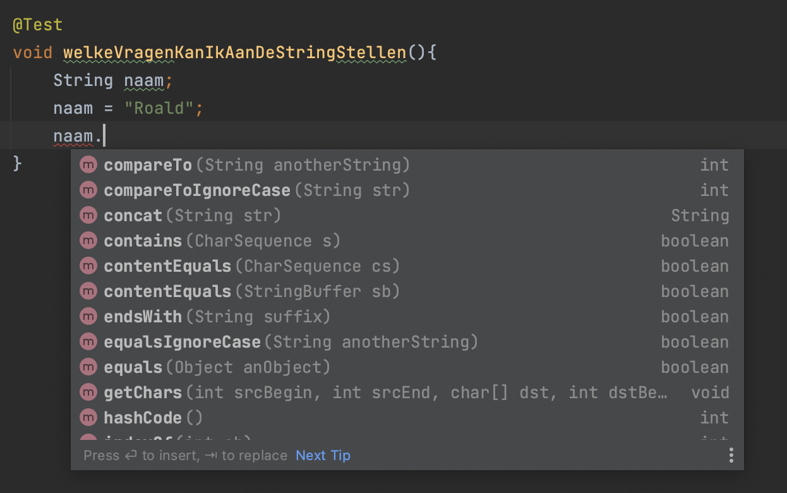

### Objecten

```java 

@Test
public void hetAanmakenVanRoald() {
	String naam; // hier declareer je variabele, een doosje
	
	naam = "Roald"; // hier stop je een string in
	// een string is geen primitive maar wat dan wel
	// een string is een reference naar een object
	// een object van het type String
	
}
```

---

### Wat is een object

* een logisch samenhangend geheel van:
	1. data
	2. gedrag

* de data?
	* de characters 'R', 'o', 'a','l' en 'd'
* het gedrag?
	* Wat voor vragen kun je aan het String object vragen?
	* Hier betekent het, welke methoden kun je aanroepen op "Roald"	

---

### Welke methode heeft een String object?



---

### Wat doen de methodes?

* Wat doet:
	* compareTo
	* hoe moeten we het aanroepen?
	* wat geeft de methode terug?
	* hoe zie ik dat?

---

### Opdrachten

* Maak afzonderlijke tests waarin je per test
de volgende methodes van de String "Roald" uitprobeert?
	* concat
	* contains
	* endsWidth
	* equals
	* equalsIgnoreCase


